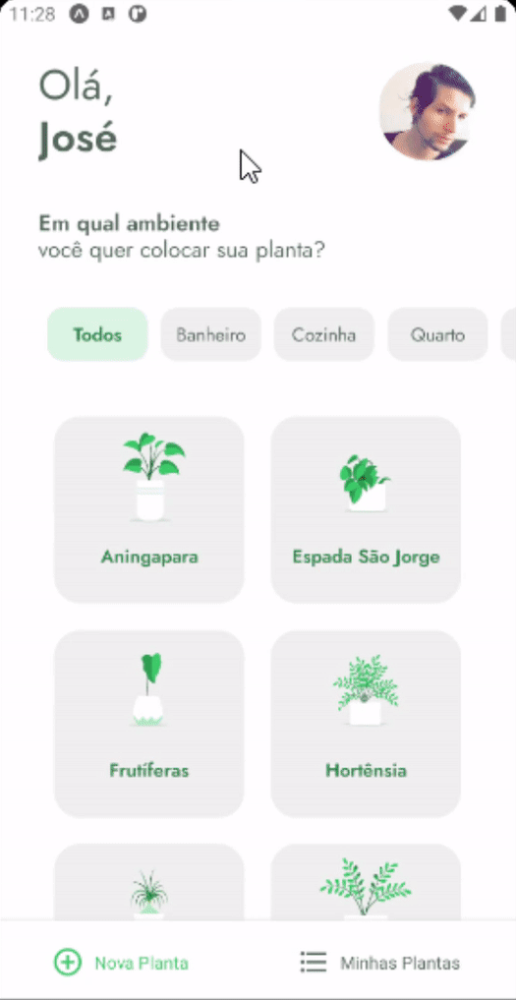

<p align="center">
   
</p>

<p align="center">
  
 

  <a aria-label="Last Commit" href="https://github.com/Olliveer/Olliveer-nlw/commits/master">
    
  </a>
  <a href="https://github.com/Olliveer/plantmanager/commits/master">
    
  </a>
  
</p>

<b>PlantManager</b> é um aplicativo desenvolvido utilizando React Native e TypeScript durante a NLW#5 da [Rocketseat](https://github.com/Rocketseat). Esse projeto consiste em ajuda-lo a gerenciar suas plantihas.

# :pushpin: Conteúdo

- [Tecnologias](#computer-tecnologias)
- [Executando](#construction_worker-executando)
- [Autores](#computer-autores)
- [Licença](#closed_book-licença)

### Demonstração

<div>
  
  
</div>

# :computer: Tecnologias

Este projeto foi feito utilizando as seguintes tecnologias:

- [React Native](https://reactnative.dev/)
- [Expo](https://expo.io/)
- [Typescript](https://www.typescriptlang.org/)
- [Axios](https://github.com/axios/axios)
- [date-fns](https://date-fns.org/)
- [lottie-react-native](https://github.com/lottie-react-native/lottie-react-native)
- [react-native-svg](https://github.com/react-native-svg/react-native-svg)
- [react-native-iphone-x-helper](https://github.com/ptelad/react-native-iphone-x-helper)

# :construction_worker: Executando

## 1. Clone o Repositório

```bash
https://github.com/Olliveer/plantmanager.git
```

## 2. Instale as Dependencias

```bash
yarn
```

## 3. Acesse o arquivo `api` na pasta `src/services` e altere a `baseURL` para a sua

```javascript
import axios from "axios";

const api = axios.create({
  baseURL: "http://SUA_URL:3333",
});

export default api;
```

## 4. Inicie o Servidor através do JSON Sever

```bash
yarn server
```

> 💡 **Observação**
>
> Caso não tenha o **JSON Server** instalado ou não saiba o que é, [acesse aqui.](https://github.com/typicode/json-server#getting-started)

## 5. Inicie o Expo

```bash
$ expo start

$ yarn server
```

# :closed_book: Licença

Esse projeto está sob a licença MIT. Veja o arquivo [LICENSE](LICENSE) para mais detalhes.

---

[](https://www.linkedin.com/in/joseooliveira/)
